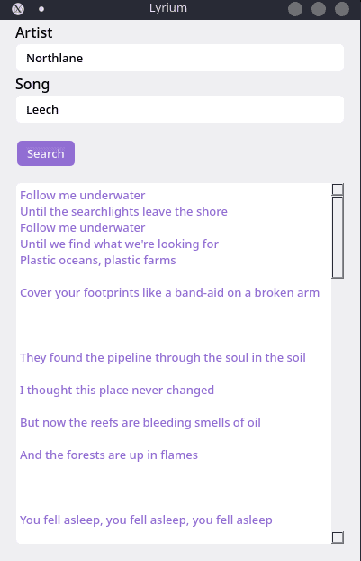

# Lyrium

<center></center>

Lyrium is a cross platform desktop lyrics app powered by [NodeGui](https://docs.nodegui.org/), built on top of [QT](https://www.qt.io/).

### ⬇️ Download

_Soon™️_

### 📸 Screenshot

<center></center>

### 🔨 Build

```bash
git clone https://github.com/neumanf/lyrium
cd lyrium
npm install
npm start
```

### 📜 License

MIT
